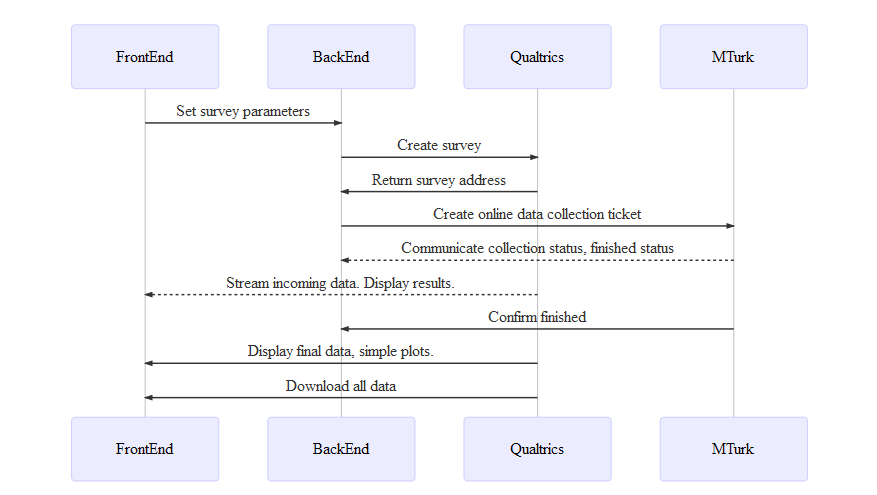

---

---

<a href="https://github.com/BDVickers/UM-MTurkQualtricsIntegration/blob/master/MTurkQualtricsIntegration.md">If you’re having trouble viewing things, use the web link here</a>

<h1 id="simple-interface-for-instructorsstudents">Simple Interface for Instructors/Students</h1>

<strong>MTurk and Qualtrics Integration</strong>

<strong>June 13, 2018</strong>

<h2 id="goal">Goal</h2>

Primarily, we want a <em>simple, intuitive</em> interface for instructors and students to:

<ol>
<li>

Set up a psychological study in <strong>Qualtrics</strong>

</li>
<li>

Collect data through <strong>MTurk</strong> or TurkPrime

<ul>
<li>TurkPrime will definitely be used for student projects requiring specialized groups of participants. For in-class experiments either could be used, but within MTurk the software needs to do the “batching” that TurkPrime does, in order to avoid prohibitively high MTurk fees.</li>
</ul>
</li>
<li>

<strong>Visualize data</strong> (from <a href="http://Qualtrics.com">Qualtrics.com</a>) as it comes in

<ul>
<li>Do various simple plots</li>
</ul>
</li>
<li>

<strong>Download data</strong> for any other demonstrations

</li>
</ol>

<em>Note:</em> The version that students use for their projects and the version that instructors use live in the classroom have somewhat different constraints, so two versions of the interface may be necessary.

More completely, here’s the general process that we’ll want the program to go through for each request:

<svg xmlns="http://www.w3.org/2000/svg" id="mermaid-svg-YrnwSMiBF39GQuOH" height="100%" width="100%" style="max-width:850px;" viewBox="-50 -10 850 476"><g></g><g><line id="actor1783" x1="75" y1="5" x2="75" y2="465" class="actor-line" stroke-width="0.5px" stroke="#999"></line><rect x="0" y="0" fill="#eaeaea" stroke="#666" width="150" height="65" rx="3" ry="3" class="actor"></rect><text x="75" y="32.5" dominant-baseline="central" alignment-baseline="central" class="actor" style="text-anchor: middle;"><tspan x="75" dy="0">FrontEnd</tspan></text></g><g><line id="actor1784" x1="275" y1="5" x2="275" y2="465" class="actor-line" stroke-width="0.5px" stroke="#999"></line><rect x="200" y="0" fill="#eaeaea" stroke="#666" width="150" height="65" rx="3" ry="3" class="actor"></rect><text x="275" y="32.5" dominant-baseline="central" alignment-baseline="central" class="actor" style="text-anchor: middle;"><tspan x="275" dy="0">BackEnd</tspan></text></g><g><line id="actor1785" x1="475" y1="5" x2="475" y2="465" class="actor-line" stroke-width="0.5px" stroke="#999"></line><rect x="400" y="0" fill="#eaeaea" stroke="#666" width="150" height="65" rx="3" ry="3" class="actor"></rect><text x="475" y="32.5" dominant-baseline="central" alignment-baseline="central" class="actor" style="text-anchor: middle;"><tspan x="475" dy="0">Qualtrics</tspan></text></g><g><line id="actor1786" x1="675" y1="5" x2="675" y2="465" class="actor-line" stroke-width="0.5px" stroke="#999"></line><rect x="600" y="0" fill="#eaeaea" stroke="#666" width="150" height="65" rx="3" ry="3" class="actor"></rect><text x="675" y="32.5" dominant-baseline="central" alignment-baseline="central" class="actor" style="text-anchor: middle;"><tspan x="675" dy="0">MTurk</tspan></text></g><defs><marker id="arrowhead" refX="5" refY="2" markerWidth="6" markerHeight="4" orient="auto"><path d="M 0,0 V 4 L6,2 Z"></path></marker></defs><defs><marker id="crosshead" markerWidth="15" markerHeight="8" orient="auto" refX="16" refY="4"><path fill="black" stroke="#000000" stroke-width="1px" d="M 9,2 V 6 L16,4 Z" style="stroke-dasharray: 0, 0;"></path><path fill="none" stroke="#000000" stroke-width="1px" d="M 0,1 L 6,7 M 6,1 L 0,7" style="stroke-dasharray: 0, 0;"></path></marker></defs><g><text x="175" y="93" class="messageText" style="text-anchor: middle;">Set survey parameters</text><line x1="75" y1="100" x2="275" y2="100" class="messageLine0" stroke-width="2" stroke="black" marker-end="url(#arrowhead)" style="fill: none;"></line></g><g><text x="375" y="128" class="messageText" style="text-anchor: middle;">Create survey</text><line x1="275" y1="135" x2="475" y2="135" class="messageLine0" stroke-width="2" stroke="black" marker-end="url(#arrowhead)" style="fill: none;"></line></g><g><text x="375" y="163" class="messageText" style="text-anchor: middle;">Return survey address</text><line x1="475" y1="170" x2="275" y2="170" class="messageLine0" stroke-width="2" stroke="black" marker-end="url(#arrowhead)" style="fill: none;"></line></g><g><text x="475" y="198" class="messageText" style="text-anchor: middle;">Create online data collection ticket</text><line x1="275" y1="205" x2="675" y2="205" class="messageLine0" stroke-width="2" stroke="black" marker-end="url(#arrowhead)" style="fill: none;"></line></g><g><text x="475" y="233" class="messageText" style="text-anchor: middle;">Communicate collection status, finished status</text><line x1="675" y1="240" x2="275" y2="240" class="messageLine1" stroke-width="2" stroke="black" marker-end="url(#arrowhead)" style="stroke-dasharray: 3, 3; fill: none;"></line></g><g><text x="275" y="268" class="messageText" style="text-anchor: middle;">Stream incoming data. Display results.</text><line x1="475" y1="275" x2="75" y2="275" class="messageLine1" stroke-width="2" stroke="black" marker-end="url(#arrowhead)" style="stroke-dasharray: 3, 3; fill: none;"></line></g><g><text x="475" y="303" class="messageText" style="text-anchor: middle;">Confirm finished</text><line x1="675" y1="310" x2="275" y2="310" class="messageLine0" stroke-width="2" stroke="black" marker-end="url(#arrowhead)" style="fill: none;"></line></g><g><text x="275" y="338" class="messageText" style="text-anchor: middle;">Display final data, simple plots.</text><line x1="475" y1="345" x2="75" y2="345" class="messageLine0" stroke-width="2" stroke="black" marker-end="url(#arrowhead)" style="fill: none;"></line></g><g><text x="275" y="373" class="messageText" style="text-anchor: middle;">Download all data")</text><line x1="475" y1="380" x2="75" y2="380" class="messageLine0" stroke-width="2" stroke="black" marker-end="url(#arrowhead)" style="fill: none;"></line></g><g><rect x="0" y="400" fill="#eaeaea" stroke="#666" width="150" height="65" rx="3" ry="3" class="actor"></rect><text x="75" y="432.5" dominant-baseline="central" alignment-baseline="central" class="actor" style="text-anchor: middle;"><tspan x="75" dy="0">FrontEnd</tspan></text></g><g><rect x="200" y="400" fill="#eaeaea" stroke="#666" width="150" height="65" rx="3" ry="3" class="actor"></rect><text x="275" y="432.5" dominant-baseline="central" alignment-baseline="central" class="actor" style="text-anchor: middle;"><tspan x="275" dy="0">BackEnd</tspan></text></g><g><rect x="400" y="400" fill="#eaeaea" stroke="#666" width="150" height="65" rx="3" ry="3" class="actor"></rect><text x="475" y="432.5" dominant-baseline="central" alignment-baseline="central" class="actor" style="text-anchor: middle;"><tspan x="475" dy="0">Qualtrics</tspan></text></g><g><rect x="600" y="400" fill="#eaeaea" stroke="#666" width="150" height="65" rx="3" ry="3" class="actor"></rect><text x="675" y="432.5" dominant-baseline="central" alignment-baseline="central" class="actor" style="text-anchor: middle;"><tspan x="675" dy="0">MTurk</tspan></text></g></svg>

<h2 id="background">Background</h2>
<h3 id="psychology">Psychology</h3>

For in-class experiments, we need to think about what parts the instructor would do prior to class. In class, we want to be able to make minor modifications and launch the study, using a very simple interface.

Largely, what we’re going to do is automate the setup of a web page through Qualtrics (a site for quick setup and easy presentation of surveys). There are a few different designs that we’ll want to implement. The simplest are as follows:

<ul>
<li>

General survey

<ul>
<li>Collect the same survey questions from everyone.</li>
</ul>
</li>
<li>

2-level, <strong>between-subjects</strong> survey

<ul>
<li>Collect 2 different, related questions from different sets of people</li>
</ul>
</li>
<li>

2-level, <strong>within-subjects</strong> survey

<ul>
<li>Collect 2 different, related questions from <em>every</em> person</li>
</ul>
</li>
</ul>

In addition to these similar or different questions, there may be “baseline” questions that every person gets asked.

<code>Example: General survey</code>

We’re interested in people’s knowledge of computer science. Everyone gets a range of questions on computer science. We get one response from each person to each question.

<code>Example: 2-level, between-subjects survey</code>

We’re interested in whether students with a Java background design an algorithm better than students with a C++ background. Group A are Java students and are asked how to design an algorithm in Java. Group B are C++ students and are asked how to design the same algorithm in Java. We get one response from each person to the one asked question.

<code>Example: 2-level, within-subjects survey</code>

We’re interested in whether the wording of a question elicits more accurate responses depending on how you word it. People will see each of two questions, but in randomized order (some see Phrasing A first, others see Phrasing B first). We get two responses from each person here, one from each question.

<h3 id="sites">Sites</h3>
<h4 id="qualtrics-umich.qualtrics.com">Qualtrics (<a href="http://umich.qualtrics.com">umich.qualtrics.com</a>)</h4>

Qualtrics is a site for <strong>survey data collection</strong>. It allows you to design surveys, change questions and responses, and launch a link so that sets of people can view it. It is typically viewed with an online interface.

<em>Our Input</em>

<ul>
<li>

Through UM, Qualtrics requires Kerberos logon credentials to access account-specific information.

</li>
<li>

Survey name

</li>
<li>

Survey design (survey, within-subjects, between-subjects, etc.)

</li>
<li>

Survey questions

</li>
<li>

Survey responses

</li>
</ul>

<em>Questions</em>

<ul>
<li>

Is it easy to link credentials to a specific user? Should we have a general, UM database of questions/surveys that all users can access?

</li>
<li>

What is the easiest way to interface to Qualtrics?

</li>
<li>

Surveys can get complicated. Should we start by building templates for people to access?

</li>
</ul>
<h4 id="mturk--amazon-mechanical-turk-httpswww.mturk.com">MTurk / Amazon Mechanical Turk (<a href="https://www.mturk.com/">https://www.mturk.com/</a>)</h4>

Amazon’s Mechanical Turk is used for sending out a survey to a pool of users on the internet who have agreed to participate in them. They’re allowed to self-select into surveys. On our end, we can give some information about surveys. Launching a survey through TurkPrime is similar, but not exactly the same.

<em>Our Input</em>

<ul>
<li>

Survey information (name, short description, longer description of what people will be doing)

</li>
<li>

Amount of payment to participants for completing the survey

</li>
<li>

Source of funds (e.g., through paypal)

</li>
<li>

Student projects need GSI approval before funds are made available, and the funds for each student project must be strictly limited (though variable from project to project) by the GSI.

</li>
<li>

Who the survey goes out to (e.g., USA only, high quality vs. all workers via their metrics, etc.)

</li>
</ul>

<em>Questions</em>

<ul>
<li>Each request will be a new request. If we don’t get people coming in fast enough we might need to cancel and reset a request. Can we handle this?</li>
</ul>
<h2 id="processes">Processes</h2>
<h3 id="set-up-study">Set-up study</h3>

<strong>Requirements</strong>

<ul>
<li>

Create user interface to enter survey information

</li>
<li>

Includes survey name, type of survey (general, within-subjects, between-subjects), question(s), and responses for each question

</li>
</ul>
<h3 id="collect-data-through-mturk">Collect data through MTurk</h3>

<em>Requirements</em>

<ul>
<li>

Pull survey URL from set-up study (above)

</li>
<li>

Set request information (description, payment, worker qualifications)

</li>
<li>

Run data collection and inform when done

</li>
</ul>
<h3 id="visualize-data">Visualize data</h3>

<em>Requirements</em>

<ul>
<li>

Pull data from Qualtrics as it comes in

</li>
<li>

Download data or read it into memory

</li>
<li>

Plot one to a few variables as they come in (generally some measure of central tendency, like mean, and variability, like SD or SE)

</li>
<li>

Plot histograms of other variables

</li>
<li>

Plot scatterplot matrices of multiple variables

</li>
</ul>
<h3 id="download-data">Download data</h3>

<em>Requirements</em>

<ul>
<li>

Download data from Qualtrics to a CSV (<code>*.csv</code>), SPSS (<code>*.sav</code>), or Excel (<code>*.xlsx</code>) file (native from interface to Qualtrics)

</li>
<li>

Open folder with downloaded data

</li>
</ul>
<h2 id="general-questions">General Questions</h2>
<ul>
<li>

<strong>GUI</strong>: What’s the easiest way for you guys to setup an interface for the users? Can we do a simple GUI that links to the same account and payment information?

</li>
<li>

<strong>Simplifications</strong>: Should we start with a simple prototype before getting into more complex versions of the program?

</li>
<li>

<strong>Feasibility</strong>: How easy will this be to program? Can we just develop in a high-level program like JavaScript or Python or do you focus on other languages?

</li>
</ul>

